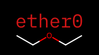
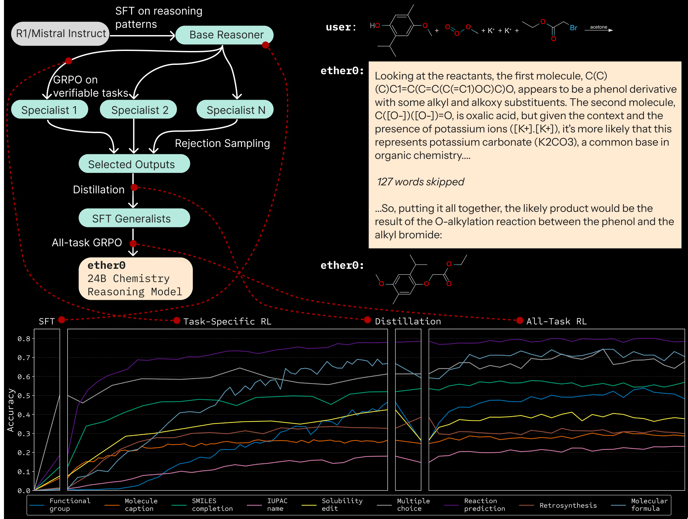

[](https://github.com/Future-House/ether0)
[](https://www.repostatus.org/#active)

[](https://github.com/Future-House/ether0/actions)
<a href="https://github.com/psf/black"></a>
[](https://www.python.org)

[](https://huggingface.co/futurehouse/ether0)
[](https://huggingface.co/datasets/futurehouse/ether0-benchmark)



_ether0: a scientific reasoning model, dataset, and reward functions for chemistry._

# ether0 Reward Model

This repo contains the reward model for evaluating ether0 and similar models, along with utilities for working with the verifiable rewards in [our benchmark](https://huggingface.co/datasets/futurehouse/ether0).

## Overview

ether0 is a reasoning language model post-trained through a loop of:

1. Supervised fine-tuning (SFT) on long chain-of-thought reasoning traces,
   to elicit reasoning from a base model.
2. Reinforcement learning with verifiable rewards (RLVR)
   to improve reasoning on focused task groups, at their own pace.
   These multitask learned models are referred to as 'specialists'.
3. Rejection sampling to filter specialists' reasoning
   for correctness and quality.
4. SFT on the base model again to make a 'generalist' reasoning model.
5. RLVR to recover any lost performance and push further in an all-task setting.



### Repo Structure

This repo contains several packages:

- `ether0`: reward functions, `rdkit` data utilities,
  dataset generation prompts, dataset data models,
  language model training prompts, and data models.
- `ether0.remotes`: server code for ether0 reward functions involving
  exotic packages and/or third party models.

> [!NOTE]
> This repo does not contain training code,
> although you can find open source repositories like [NeMo-RL](https://github.com/NVIDIA/NeMo-RL)
> or [Hugging Face TRL](https://github.com/huggingface/trl)
> that can do the SFT and RL phases of training.

### Open Weights

Please see our open-source weights on Hugging Face: https://huggingface.co/futurehouse/ether0

```python
from transformers import AutoModelForCausalLM, AutoTokenizer

model = AutoModelForCausalLM.from_pretrained("futurehouse/ether0")
tokenizer = AutoTokenizer.from_pretrained("futurehouse/ether0")
```

### Open Test Set

Please see our open-source benchmark (test set) on Hugging Face: https://huggingface.co/datasets/futurehouse/ether0-benchmark

```python
from datasets import load_dataset

test_ds = load_dataset("futurehouse/ether0-benchmark", split="test")
```
